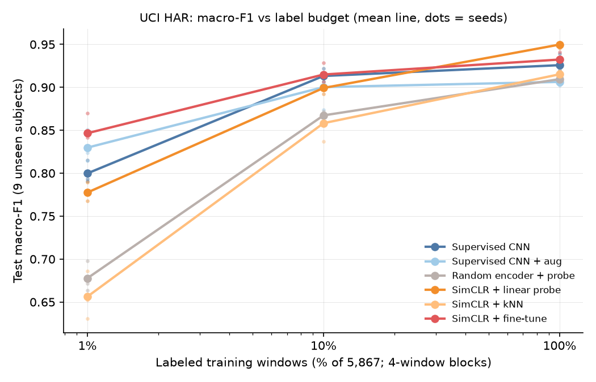

# Phase-one report: contrastive pretraining under limited labels (UCI HAR)

Minimum viable study, 2026-10-07. Protocol: [PROTOCOL.md](PROTOCOL.md) (committed `f963d68`, before any run).
Audit: [AUDIT.md](AUDIT.md). The validation selections were frozen and committed (`846fb66`) before the
one-time test evaluation. Code: `src/lowlabel*.py`, `src/augment.py`, `src/ssl.py`; tests:
`tests/test_lowlabel.py`.

## Result

Test = 9 unseen official UCI test subjects (2947 windows). Values are mean ± sample std (ddof = 1) over seeds
42/43/44. Each seed fixes the label subset, validation subset, initialization and SSL run, and all methods
share them. Labels are block-sampled: 59 / 587 / 5867 training windows, plus 15 / 148 / 1485 validation windows.

| Condition | 1 % | 10 % | 100 % | Trainable params |
| :--- | ---: | ---: | ---: | ---: |
| Supervised CNN | 0.800 ± 0.014 | 0.913 ± 0.008 | 0.926 ± 0.011 | 146,182 |
| Supervised CNN + same augmentations | 0.830 ± 0.019 | 0.900 ± 0.023 | 0.906 ± 0.005 | 146,182 |
| Random encoder + linear probe | 0.678 ± 0.018 | 0.867 ± 0.004 | 0.910 ± 0.006 | 1,542 |
| SimCLR + linear probe (frozen) | 0.778 ± 0.011 | 0.899 ± 0.006 | **0.950 ± 0.004** | 1,542 |
| SimCLR + exact kNN (frozen) | 0.656 ± 0.028 | 0.858 ± 0.018 | 0.915 ± 0.003 | 0 |
| SimCLR + full fine-tune | **0.847 ± 0.021** | 0.915 ± 0.012 | 0.932 ± 0.008 | 146,182 |

Paired differences (same seed, split and labels; per seed 42 / 43 / 44):

| Pair | 1 % | 10 % | 100 % |
| :--- | --- | --- | --- |
| fine-tune − supervised | +0.047 (+0.076 / +0.026 / +0.038) | +0.002 (−0.005 / +0.003 / +0.007) | +0.007 (−0.014 / +0.010 / +0.023) |
| fine-tune − supervised + aug | +0.017 (+0.055 / −0.009 / +0.004) | +0.015 (−0.009 / +0.036 / +0.016) | +0.026 (+0.013 / +0.029 / +0.037) |
| linear probe − supervised | −0.022 (−0.004 / −0.040 / −0.023) | −0.014 (−0.008 / −0.005 / −0.029) | +0.024 (+0.013 / +0.031 / +0.028) |
| fine-tune − linear probe | +0.069 (+0.080 / +0.066 / +0.061) | +0.016 (+0.003 / +0.008 / +0.036) | −0.017 (−0.027 / −0.021 / −0.004) |

Raw data: `mvs/test_metrics.json` (per-class F1, confusion matrices, per-subject F1, every prediction),
`mvs/selections.json`, `mvs/summary.json`, `mvs/f1_vs_budget.png`, and the logs.

## What the results support

1. **At 1 % labels (59 windows), SimCLR pretraining followed by fine-tuning beats the same CNN trained from
   scratch in all 3 seeds** (+0.047 mean). Most of this advantage disappears against the supervised CNN
   trained with the same augmentations (+0.017, with one seed negative). The augmentations explain a large
   share of the low-label gain; pretraining adds a smaller, inconsistent amount on top.
2. **Freezing hurts at low labels and helps at full labels.** Fine-tuning beats the frozen probe by 0.069
   at 1 % (all seeds), while the frozen probe beats fine-tuning by 0.017 at 100 % (all seeds). This is the
   distinction the fine-tune condition was added to separate.
3. **At 100 % labels the frozen SimCLR encoder with a linear probe (1,542 parameters trained after pretraining;
   the 144,640-parameter encoder was trained by SimCLR) is the best model in this
   study:** 0.950 ± 0.004, above the supervised CNN in all 3 seeds (+0.024). It is also above the legacy direct
   CNN (0.934; its retraining matched the saved metrics and confusion matrices exactly). The gain comes almost entirely from the hard Sitting/Standing pair
   (per-class F1 0.914 / 0.913 vs 0.811 / 0.839). The probe's worst test subject is also higher
   (0.76–0.82 vs 0.65–0.73).
4. **Representation learning matters.** A random encoder with BN statistics recalibrated on the same unlabeled
   pool trails the SimCLR probe at every budget (by 0.03–0.10).
5. **Exact kNN on SimCLR embeddings is the weakest SimCLR readout** at every budget. The embedding geometry is
   less class-separable than a learned linear boundary reveals.

## What the results do not support

- No significance or equivalence claims: there are 3 seeds, and seed variance does not cover variation across
  people. Differences under about 0.02 with mixed-sign seeds (10 % budget, fine-tune vs supervised) are
  inconclusive.
- "Pretraining beats augmentation-matched supervision" is not shown at 1 % or 10 %.
- Why the frozen probe wins at 100 % is not established. A plausible explanation is that pretraining under
  rotation and scaling invariance yields posture features that full supervision on 17 subjects overfits away.
  Another is that the probe's validation-tuned regularization suits the subject shift. The planned ablation
  (removing rotation) would test the first.
- The SSL methods saw all 5867 unlabeled pool windows; supervised baselines did not. That is the point of the
  comparison, but it is extra information.

## Unexpected findings and negative results (experiment log)

- **Validation granularity:** at 10 %, `V_b` has 148 windows. All supervised and fine-tune stage-A configs tied
  at 0.9250 because the models peak at the first checkpoint (step 70) and macro-F1 on 148 block-sampled windows
  takes few values. This is not a bug (histories inspected); the predeclared tie-break chose the first grid entry.
  At 1 %, `V_b` has 15 windows and validation F1 often hits 1.000, so selection there is close to arbitrary.
  This is an inherent cost of honest low-label validation and is reported, not tuned around.
- **Augmentation hurts the supervised CNN at 100 %** (0.906 vs 0.926). Its Sitting F1 drops to 0.734: strong
  rotations (up to 30°) partly blur the gravity-direction cue between Sitting and Standing. The frozen SimCLR
  probe does not show this.
- The new `sup` at 100 % (0.926) is below the legacy direct CNN (0.934). It uses the same architecture but a
  different schedule: 1400 steps, validation every 70 steps, and the stage-A hyperparameters.
- SSL stage A: τ = 0.1 beat τ = 0.5, and strong augmentation beat weak (probe validation F1 0.960 vs 0.912 at
  τ = 0.1). No run collapsed: normalized per-dimension std was 0.040–0.044, against a 0.0063 alarm threshold;
  effective rank was 71–81 of 256.

## Cost (RTX 5060 Laptop GPU, `torch.cuda.max_memory_allocated`)

SimCLR pretraining: 31–50 s per run (200 epochs, batch 256), 226 MB peak, amortized across all budgets and
SSL conditions of a seed. Supervised and fine-tune runs: 4–6 s (1400 steps), 154 MB. Probes and kNN: under 8 s.
Embedding dimension: 256.

## Comparison with published work

Sources were checked on 2026-10-07: the arXiv abstracts, plus the full text of Haresamudram et al.

- **SimCLR** (Chen et al., 2020, arXiv:2002.05709): the NT-Xent objective, the projection head and the use of
  pre-head features are taken from here. The adaptations are to a 1D-CNN and to physics-consistent IMU
  augmentations.
- **Tang, Perez-Pozuelo, Spathis & Mascolo (2020)**, "Exploring Contrastive Learning in Human Activity
  Recognition for Healthcare" (NeurIPS 2020 ML4H workshop, arXiv:2011.11542). They tested 64 transformation
  combinations for SimCLR on HAR and found that **random rotation with fine-tuning** gave the best result, improving
  over supervised and unsupervised baselines. **This study agrees on both points:** rotation is the augmentation the
  gain depends on (ablation), and fine-tuning beats the frozen probe at low budgets. It adds two qualifications:
  the largest fine-tuning gains over a from-scratch CNN occurred at the 1 % budget on subject-held-out UCI HAR, and an
  augmentation-matched supervised baseline absorbs much of it.
- **Haresamudram, Essa & Plötz (2022)**, "Assessing the State of Self-Supervised Human Activity Recognition using
  Wearables" (IMWUT 6(3), arXiv:2202.12938). They pretrain seven SSL methods, including SimCLR, on the large
  Capture-24 dataset and evaluate *frozen* encoders with an MLP classifier on other target datasets. They also
  vary the amount of pretraining data and labeled data. Their SimCLR rotation draws axis and angle uniformly.
  **Differences:** this study pretrains in-domain on only 17 subjects, evaluates on held-out subjects of the same
  dataset, and restricts rotation to ±30° so that gravity direction can still separate postures. It also adds
  end-to-end fine-tuning. The frozen-vs-fine-tune crossover found here (frozen worse at 1 %, better at 100 %) is a
  reason not to read frozen-encoder benchmarks alone as a measure of what pretraining offers at low labels.
- No absolute scores from these papers are compared: their datasets, splits and label-sampling schemes differ, so
  the numbers are not commensurable.

## Limitations

There is one dataset (smartphone at the waist, 30 subjects) and 3 seeds. The test set was inspected in earlier
work (AUDIT D8). Stage-A tuning used 10 % labels, more than the 1 % budget, symmetrically for both families.
(Written before Amendment 1: the 5 % and 25 % budgets, the sampling sensitivity and the rotation ablation were
then run; see the Expansion section.)

## Questions you should be able to answer

1. What does one SimCLR batch contain, and which 2N − 2 views are negatives? Why are 50 %-overlapping
   neighbours a false-negative risk?
2. Why can't a test-subject window reach the standardizer, the SSL inputs or the kNN reference set? Which test
   enforces each boundary?
3. Why does scaling validation labels with the budget make 1 % selection noisy, and why is that still the
   honest choice?
4. Why is "SimCLR + fine-tune beats supervised at 1 %" weaker evidence once `sup_aug` is included?
5. Why exclude full SO(3) rotation, and what does the `sup_aug` Sitting F1 drop suggest about even 30°?
6. Why does the frozen probe beat fine-tuning at 100 % but lose at 1 %?

## Expansion (Amendment 1): more budgets, i.i.d. sampling, rotation ablation

Methods and stage-A choices are unchanged; the SSL encoders are reused. Each run had its own selections committed
(commit `816dcea`) before its single test evaluation. Values are test macro-F1, mean over seeds 42/43/44,
with per-seed paired differences.

**5 % and 25 % budgets** (`budgets_5_25/`):

| Condition | 5 % (294) | 25 % (1466) |
| :--- | ---: | ---: |
| Supervised CNN | 0.899 ± 0.019 | 0.935 ± 0.007 |
| Supervised CNN + aug | 0.884 ± 0.023 | 0.906 ± 0.006 |
| SimCLR + linear probe | 0.892 ± 0.009 | 0.930 ± 0.008 |
| SimCLR + fine-tune | 0.902 ± 0.008 | 0.926 ± 0.016 |

Fine-tune − supervised: +0.004 (+0.028 / −0.007 / −0.009) at 5 %, and −0.009 at 25 %. There is no pretraining
advantage over plain supervision between 5 % and 25 %.

**Single-window sampling instead of 4-window blocks** (`iid/`, `--block-len 1`, 1 % and 10 %). This is still
per-class, subject-round-robin ordering, not uniform i.i.d. sampling:

| Condition | 1 % | 10 % |
| :--- | ---: | ---: |
| Supervised CNN | 0.861 ± 0.014 | 0.922 ± 0.012 |
| Supervised CNN + aug | 0.866 ± 0.012 | 0.912 ± 0.016 |
| SimCLR + linear probe | 0.822 ± 0.028 | 0.917 ± 0.010 |
| SimCLR + fine-tune | **0.884 ± 0.005** | **0.929 ± 0.009** |

- Every method scores higher than under block sampling at the same window count (supervised at 1 %: 0.861 vs
  0.800). **This comparison is confounded:** at 1 % the block sampler's labels come from 11 / 12 / 13 of the 17 training
  subjects (seeds 42 / 43 / 44; about 3 subjects per class), the single-window sampler's from all 17 (8–11 per class),
  and the validation subsets differ too. Temporal redundancy, subject coverage and validation sample change together,
  so the gap does not isolate the effect of contiguous labels. Isolating it would need a protocol that fixes the
  subject × class allocation.
- Fine-tune − supervised is positive in every seed at both budgets: +0.023 at 1 % (+0.030 / +0.028 / +0.012) and
  +0.008 at 10 % (+0.013 / +0.002 / +0.008). Against the augmented CNN: +0.018 at 1 % (+0.000 / +0.030 / +0.023).

**Rotation ablation** (`ablation_norot/`: strong augmentation without the 3-D rotation; validation agrees with test):

| Condition | 1 % | 10 % | 100 % |
| :--- | ---: | ---: | ---: |
| SimCLR + linear probe, no rotation | 0.597 ± 0.064 (with: 0.778) | 0.867 ± 0.015 (0.899) | 0.913 ± 0.009 (0.950) |
| SimCLR + fine-tune, no rotation | 0.760 ± 0.064 (0.847) | 0.913 ± 0.004 (0.915) | 0.920 ± 0.017 (0.932) |
| Supervised CNN + aug, no rotation | 0.805 ± 0.013 (0.830) | 0.913 ± 0.010 (0.900) | 0.923 ± 0.006 (0.906) |

Mean validation macro-F1 for the probe drops the same way (0.970 → 0.656 at 1 %, 0.947 → 0.938 at 100 %).

**What the ablation teaches.** Rotation is the augmentation that makes the contrastive representation work.
Without it, the frozen probe falls from 0.950 to 0.913 at 100 %, below the supervised CNN. The 1 % fine-tune
advantage over the augmented CNN also disappears (−0.044). For the supervised CNN the effect depends on budget.
At 1 % rotation helps the supervised CNN (0.830 with vs 0.805 without); at 10 % and 100 % it hurts (0.900 vs 0.913, 0.906 vs 0.923), and removing it restores Sitting/Standing F1 at 100 % (0.734/0.822 → 0.813/0.847). The ablation shows that
these SimCLR results depend on rotation augmentation. It does not show *why*: a learned placement invariance that
keeps posture information is one hypothesis, not a tested mechanism.

### Updated bottom line

- The **largest fine-tuning gains** over the from-scratch CNN occur at 1 % labels: +0.047 (block) and +0.023
  (single-window), positive in every seed. At higher budgets the block-sampled comparisons are mixed (5 %: +0.004,
  25 %: −0.009, 100 %: +0.007, each with a negative seed). The single-window 10 % comparison is small but positive
  in every seed (+0.008). None of this establishes a general benefit or equivalence.
- Stage-A tuning used 10 % labels for every method family, more than the 1 % budget; keep that in mind when
  reading 1 % results.
- Fine-tuning from SimCLR is at or above the augmentation-matched CNN at every budget on average (+0.015 to
  +0.026), but at most budgets one seed is negative.
- With all labels, the frozen SimCLR encoder plus linear probe (0.950) is the best model in either study, and that
  advantage depends on rotation augmentation.

## Corrections after external review (2026-10-08)

An independent review recomputed all 153 saved prediction records and 85 summary entries (all agreed), reproduced
the splits and label subsets from raw data, and found the following. All are fixed in code, with regression tests.
**No reported metric changed.**

- **Unsafe resume and cache reuse (fixed).** A rerun in an existing run directory with different settings used to
  keep old checkpoints while writing a new split manifest, and SSL caches were reused without checking inputs or
  hashes. Each run directory now records `run_config.json` (data hash, sampler, steps, SSL epochs, chosen
  hyperparameters, normalization, code hash) and refuses mismatched reuse. Reused checkpoints must match their
  sha256. Manifests are extended, never relabelled. SSL caches carry a key over pretraining inputs, normalization,
  augmentation, optimizer settings and code. Published run directories predate `run_config.json` and are protected
  by the existing post-test lock.
- **Weighted kNN rounding (fixed).** float32 cosine similarity can exceed 1 by about 1e-7, which made an exact match's
  inverse-distance weight negative. Similarities are now clipped and the weights are always positive. Re-deriving all
  21 kNN validation selections and test predictions with the fixed code on the GPU used in the study gave **identical
  selections and predictions** (`scripts/recheck_knn_fix.py`, `knn_fix_recheck.json`). On CPU one prediction of one
  model differs (unweighted vote): cross-device float differences, not the fix.
- **Checkpoint replay.** `scripts/replay_checkpoints.py` re-evaluates all 153 selected checkpoints with the current
  code. On the GPU, **every test prediction matches** the published records (`replay_cuda.json`). Checkpoint loading now
  uses `map_location`, so CPU-only replay works.
- **Fresh-run commands (fixed).** The documented defaults pointed at the published, locked `mvs/` directory. Stage A
  now refuses to overwrite existing tuning, and the documented commands use a new `--run-dir`.
- **Wording.** "Helps only at 1 %" is narrowed (see the bottom line). The `iid` run is described as single-window
  round-robin sampling, with its subject-coverage confound stated. Rotation is no longer said to hurt supervision at
  every budget. Plot x-labels name the sampler, and the 5 % / 25 % counts are corrected to 294 / 1466.
